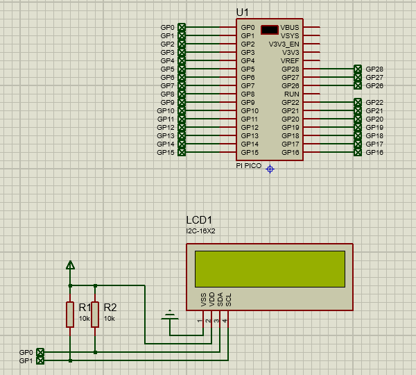

# proteus program for micropython

Proteus' micropython simulation program. Use micropython in Proteus to quickly test various sensors, modules, peripherals, and validate algorithms.

Please note that:
- Requires Proteus 8.17 sp4 or higher version.
- Simulation cannot fully simulate actual hardware.

---

## I2C LCD1602

