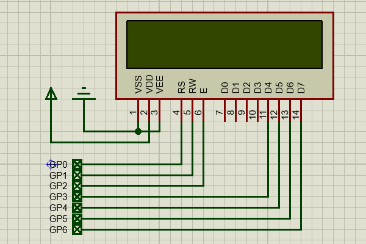
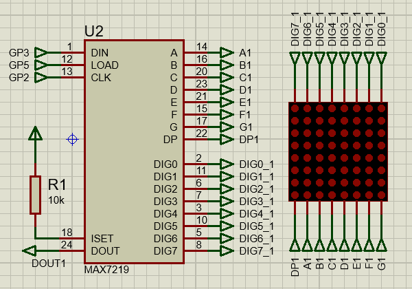
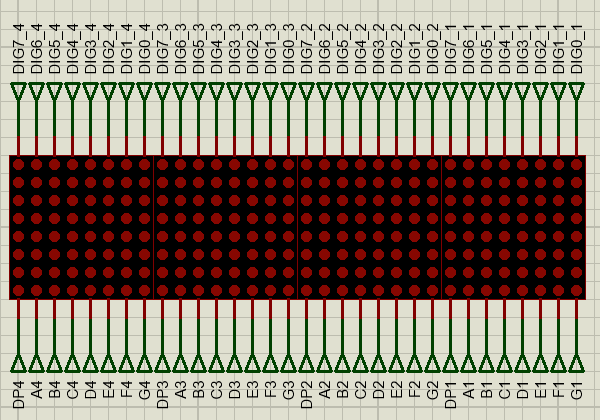
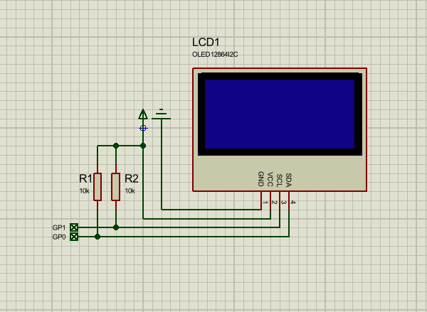
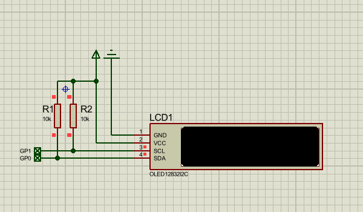
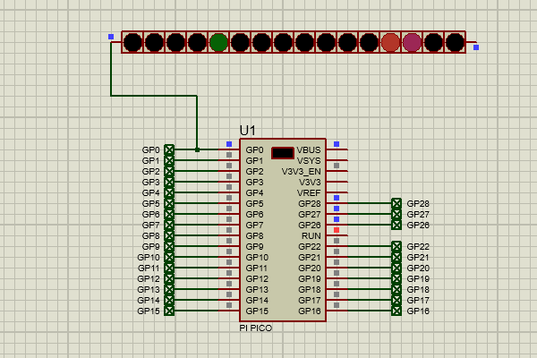
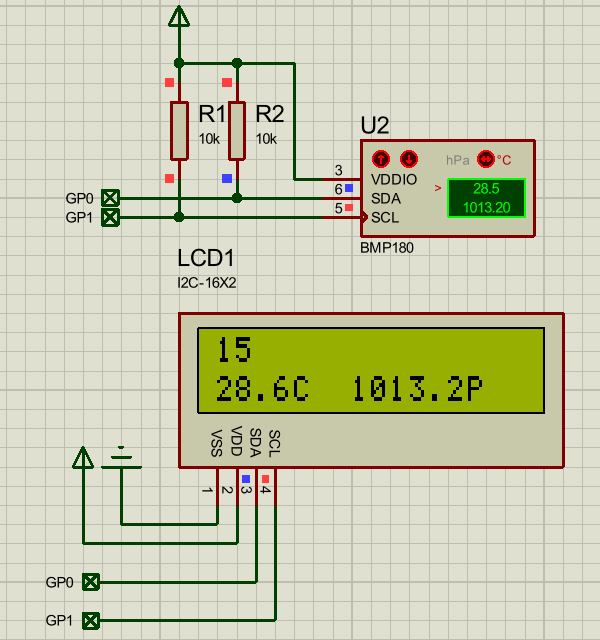
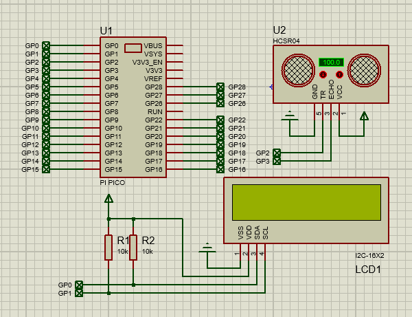
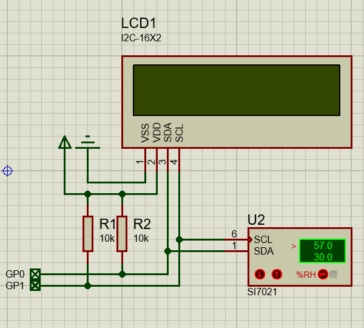
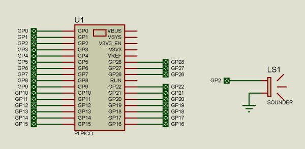

# proteus program for micropython

Proteus' micropython simulation program. Use micropython in Proteus to quickly test various sensors, modules, peripherals, and validate algorithms.

Please note that:
- Requires Proteus 8.17 sp4 or higher version.
- Simulation cannot fully simulate actual hardware.

---

## Display

### LCD1602

LCD character 16x2 display

### I2C LCD1602

A 16x2 (16 columns and 2 rows) liquid crystal display (LCD) using the I2C protocol.

### LCD1602 bigfont

show big digitals in LCD1602

### MAX7219

compact, serial input/ouput common-cathode display driver.

### MAX7219 x 4

4 max7219 modules

### I2C OLED 128x64

I2C 接口 OLED 128x64 模块

### I2C OLED ASC

I2C 接口 OLED 128x32 多字体显示

### neopixel

NeoPixel/WS2812 addressable LED.

### TM1637

7-segment LED display.

## Sensor

### bmp180

Digital, barometric pressure sensor.

### bmp280

Digital, barometric pressure sensor.

### bme280

Humidity sensor measuring relative humidity, barometric pressure and ambient temperature.

### hcsr04

HC-SR04 ultrasonic sensor modules.

### INA219

26V 12bits I2C output digital power monitor

### NTC

NTC thermistors, resistors with a negative temperature coefficient.

### sht21

Digital humidity and temperature sensor.

### si7021

I2C HUmiduty and temperature sensor.

## RTC

### DS1302

real-time clock/calendar with 31 bytes of RAM.

### DS1307

serial real-time clock.

### DS3231

extremely accurate I²C real-time clock.

### PCF8563

Real-time clock/calendar.

## Misc

### buzzer

### MCP401x

Single-channel, 7-bit, volatile digital potentiometer with I2C interface.

