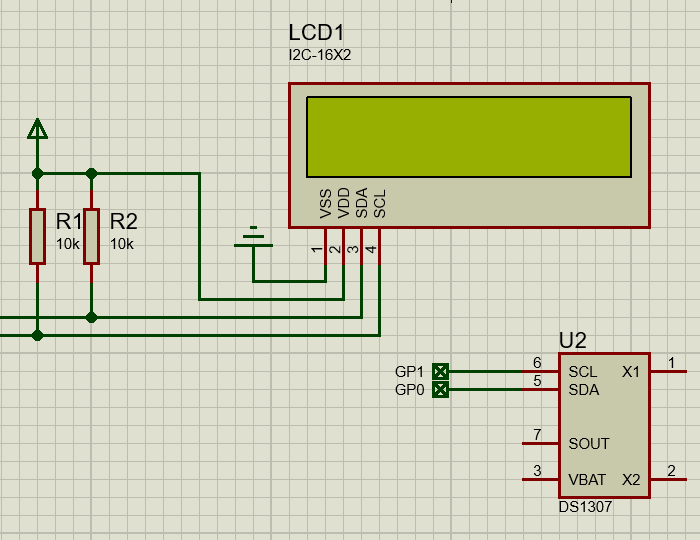

# proteus program for micropython

Proteus' micropython simulation program. Use micropython in Proteus to quickly test various sensors, modules, peripherals, and validate algorithms.

Please note that:
- Requires Proteus 8.17 sp4 or higher version.
- Simulation cannot fully simulate actual hardware.

---

## I2C LCD1602

A 16x2 (16 columns and 2 rows) liquid crystal display (LCD) using the I2C protocol.

## LCD1602 bigfont

show big digitals in LCD1602

## bmp280

Digital, barometric pressure sensor.

## bme280

Humidity sensor measuring relative humidity, barometric pressure and ambient temperature.

## DS1302

real-time clock/calendar with 31 bytes of RAM.

## DS1307

serial real-time clock.

## DS3231

extremely accurate I²C real-time clock.

## INA219

26V 12bits I2C output digital power monitor

## MCP401x

Single-channel, 7-bit, volatile digital potentiometer with I2C interface.

## NTC

NTC thermistors, resistors with a negative temperature coefficient.

## PCF8563

Real-time clock/calendar.

## sht21

Digital humidity and temperature sensor.

## TM1637

7-segment LED display.

